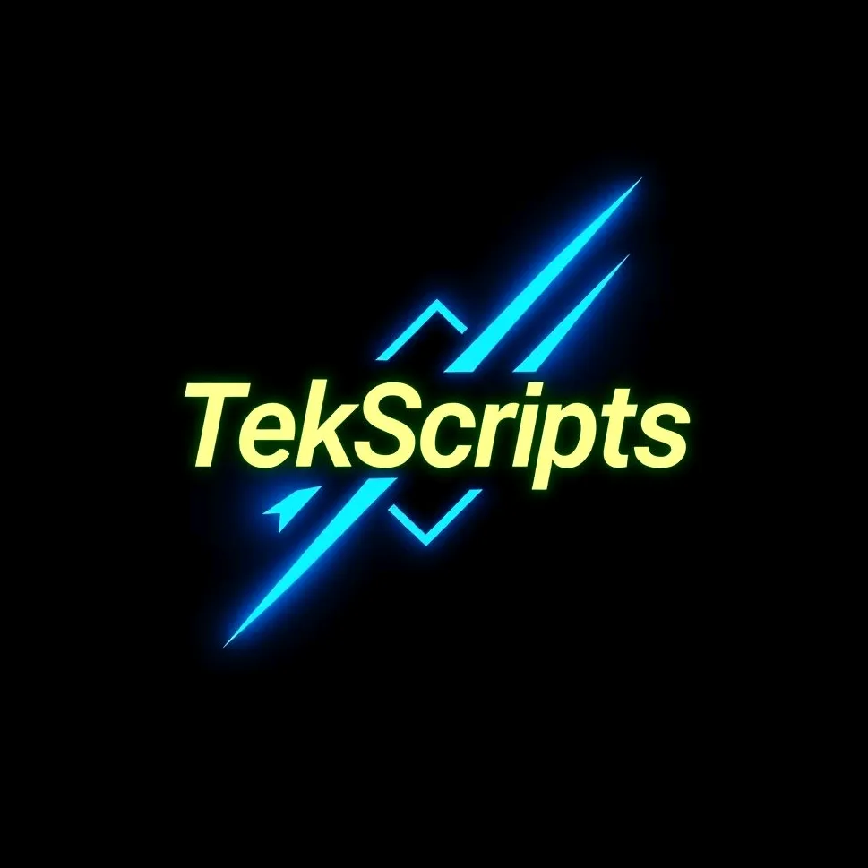

# Tekscripts UIX: Documentação Oficial

<p align="center">
  
</p>

## 📜 Visão Geral

A **Tekscripts UIX** é uma biblioteca de interface gráfica (GUI) para [Roblox](https://www.roblox.com/), desenvolvida para criadores de scripts que buscam construir menus e painéis de controle de forma rápida e intuitiva. Com uma API simplificada e um conjunto robusto de componentes, a biblioteca permite a criação de interfaces funcionais e visualmente agradáveis com poucas linhas de código.

Esta documentação detalha todos os recursos, componentes e métodos disponíveis, oferecendo um guia completo para desenvolvedores de todos os níveis.

---

## 🚀 Começando

Para integrar a Tekscripts UIX em seu projeto, o primeiro passo é carregar a biblioteca em seu ambiente de script.

> **Importante**: A linha de código abaixo deve ser executada **antes** de qualquer outra chamada à biblioteca para garantir que todas as funções sejam carregadas corretamente.

### Instalação

Copie e cole o código a seguir em seu script para carregar a biblioteca:

```lua
local Tekscripts = loadstring(game:HttpGet("[https://raw.githubusercontent.com/c0nfigs/LibUix/refs/heads/main/load.lua](https://raw.githubusercontent.com/c0nfigs/LibUix/refs/heads/main/load.lua)"))()

🏗️ Estrutura Fundamental
A estrutura da Tekscripts UIX é baseada em uma janela principal que contém abas, e cada aba pode abrigar múltiplos componentes.
Criando a Janela Principal
A janela é o contêiner principal da sua interface.
local gui = Tekscripts.new({
    Name = "Meu Painel de Controle",
    FloatText = "Abrir Painel", -- Texto flutuante para abrir/fechar
    startTab = "Principal"      -- Aba inicial
})

Criando Abas (Tabs)
As abas são usadas para organizar os componentes em diferentes seções.
local tabPrincipal = gui:CreateTab({ Title = "Principal" })
local tabConfig = gui:CreateTab({ Title = "Configurações" })
local tabPlayer = gui:CreateTab({ Title = "Jogador" })

🧩 Componentes Disponíveis
A Tekscripts UIX oferece uma vasta gama de componentes para construir sua interface.
1. Botões (Buttons)
Botões são componentes clicáveis que executam uma ação definida por uma função de callback.
gui:CreateButton(tabPrincipal, {
    Text = "Ativar ESP",
    Callback = function()
        print("Função ESP ativada!")
        -- Insira seu código aqui
    end
})

2. Interruptores (Toggles)
Interruptores permitem alternar uma funcionalidade entre os estados ligado (true) e desligado (false). O componente é altamente customizável e oferece tratamento visual de erro.
Uso Básico
local vooToggle = gui:CreateToggle(tabPrincipal, {
    Text   = "Modo Voo",
    Desc   = "Ativa a capacidade de voar no mapa.",
    Callback = function(estado)
        print("Modo Voo", estado and "ativado" or "desativado")
    end
})

Parâmetros
| Campo | Tipo | Descrição |
|---|---|---|
| Text | string | Rótulo exibido ao lado do switch. |
| Desc | string? | Texto explicativo menor sob o rótulo. |
| Callback | function(state: boolean) | Executada sempre que o estado mudar. |
| State | boolean? | Estado inicial do componente. (Padrão: false) |
API Disponível
| Método | Assinatura | Descrição |
|---|---|---|
| SetState | (state: boolean) | Altera o estado sem disparar o callback. |
| GetState | () → boolean | Retorna o estado atual. |
| Toggle | () | Inverte o estado (equivale a um clique). |
| SetText | (text: string) | Atualiza o rótulo. |
| SetDesc | (desc: string) | Atualiza a descrição. |
| SetCallback | (fn: function) | Substitui a função de callback. |
| SetLocked | (locked: boolean) | Bloqueia/desbloqueia interação do usuário. |
| Update | {Text?, Desc?, State?} | Atualiza múltiplas propriedades de uma vez. |
| Destroy | () | Remove o componente e desconecta eventos. |
Dicas de Uso
-- Exemplo de tratamento de erro e bloqueio
local invencivel = gui:CreateToggle(tabPrincipal, { Text = "Invencibilidade" })

invencivel:SetCallback(function(ativo)
    local sucesso, err = pcall(tornarInvencivel, ativo)
    if not sucesso then
        print("Erro ao ativar:", err)
        invencivel:SetState(false)  -- Reverte visualmente
        invencivel:SetLocked(true)  -- Bloqueia
        task.wait(2)
        invencivel:SetLocked(false) -- Desbloqueia após 2s
    end
end)

3. Menu Suspenso (Dropdown)
O Dropdown permite selecionar uma ou várias opções a partir de uma lista suspensa.
Uso Básico
local dropdown = gui:CreateDropdown(tabPrincipal, {
    Title = "Modo de Velocidade",
    Values = {
        { Name = "Normal" },
        { Name = "Rápido" },
        { Name = "Super Rápido" }
    },
    SelectedValue = "Normal",
    Callback = function(valorSelecionado)
        print("Velocidade definida para: " .. tostring(valorSelecionado))
    end
})

Parâmetros
| Parâmetro | Tipo | Descrição |
|---|---|---|
| Title | string | Título exibido acima do dropdown. |
| Values | table | Lista de itens (tabela com Name e opcionalmente Image). |
| Callback | function | Chamada quando a seleção muda. Recebe o valor/tabela. |
| MultiSelect | boolean? | Permite selecionar múltiplos itens. Padrão: false. |
| MaxVisibleItems | number? | Máx. de itens visíveis antes de ativar o scroll. (Padrão: 5, Máximo: 8). |
| InitialValues | table? | Itens pré-selecionados ao iniciar. |
API Disponível
| Método | Descrição |
|---|---|
| AddItem(valueInfo, position?) | Adiciona um novo item à lista. |
| RemoveItem(valueName) | Remove um item pelo nome. |
| ClearItems() | Remove todos os itens. |
| GetSelected() | Retorna o item selecionado (string ou tabela em multiseleção). |
| GetSelectedFormatted() | Retorna uma string formatada com os itens selecionados. |
| SetSelected(values) | Define os itens selecionados (string ou tabela). |
| Destroy() | Remove o dropdown e desconecta todos os eventos. |
4. Rótulos (Labels)
Usados para exibir textos informativos ou descrições na interface.
gui:CreateLabel(tabConfig, {
    Title = "Informação Importante",
    Desc = "Este painel foi desenvolvido para ser simples e prático."
})

5. Etiquetas (Tags)
Pequenos indicadores visuais, ideais para exibir versão ou status.
gui:CreateTag(tabConfig, {
    Text = "VERSÃO 1.0",
    Color = Color3.fromRGB(90, 140, 200)
})

6. Campos de Entrada (Inputs)
Permite que o usuário insira texto ou números.
-- Campo para texto
gui:CreateInput(tabPlayer, {
    Text = "Nome do Jogador",
    Placeholder = "Digite o nome...",
    Callback = function(texto)
        print("Teleportar para: " .. texto)
    end
})

-- Campo para números
gui:CreateInput(tabPlayer, {
    Text = "Walkspeed",
    Placeholder = "16",
    Type = "number", -- Define o tipo como numérico
    Callback = function(numero)
        if type(numero) == "number" then
            print("Velocidade definida para: " .. numero)
        end
    end
})

7. Linhas Divisoras (HR)
Linhas divisórias para separar visualmente os componentes.
> Status: Em desenvolvimento.
> 
8. Botão Flutuante (Float Button)
Um botão que pode ser movido livremente pela tela, ideal para ações rápidas.
local floatButton = Tekscripts:CreateFloatingButton({
    Text = "Ativar Kill Aura",
    Title = "Ferramenta",
    Callback = function(state)
        print("Kill Aura:", state)
    end
})

-- Para destruir o botão, chame: floatButton:Destroy()

9. Controle Deslizante (Slider)
O Slider permite que o usuário selecione um valor numérico dentro de um intervalo definido.
Uso Básico
local speedSlider = gui:CreateSlider(tabPrincipal, {
    Text = "Velocidade do Player",
    Min = 16,
    Max = 100,
    Step = 1,
    Value = 16,
    Callback = function(valor)
        print("Velocidade atual:", valor)
    end
})

Parâmetros
| Parâmetro | Tipo | Padrão | Descrição |
|---|---|---|---|
| Text | string | "Slider" | Título exibido no topo do componente. |
| Min | number | 0 | Valor mínimo permitido. |
| Max | number | 100 | Valor máximo permitido. |
| Step | number | 1 | Incremento mínimo por movimento. |
| Value | number | Min | Valor inicial do slider. |
| Callback | function(number) | nil | Função chamada ao alterar o valor. |
Métodos da Instância (API Pública)
| Método | Assinatura | Descrição |
|---|---|---|
| Set | (value: number) | Define um novo valor para o slider (ajusta automaticamente). |
| Get | () → number | Retorna o valor atual. |
| GetPercent | () → number | Retorna a porcentagem atual (0 a 1). |
| SetRange | (min, max, step?) | Atualiza os limites e o passo opcionalmente. |
| AnimateTo | (value, duration?) | Move suavemente o slider até o valor em uma animação. |
| OnChanged | (callback: function(number)) | Adiciona um novo listener para alterações de valor. |
| Lock | (state: boolean) | Bloqueia ou desbloqueia o slider para interação manual. |
| Update | (options: table) | Atualiza opções (Texto, Min, Max, Step, Callback). |
| Destroy | () | Remove o componente e desconecta eventos. |
Exemplo de Uso Dinâmico
slider.OnChanged(function(v)
    print("Callback secundário detectado:", v)
end)

task.wait(2)
slider:AnimateTo(200, 0.5) -- Anima para 200 em 0.5 segundos
slider:Lock(true)          -- Trava o slider

10. Seções (Sections)
Seções agrupam componentes e permitem que o conteúdo seja recolhido (colapsável) para melhor organização.
local section = gui:CreateSection(tabPrincipal, {
    Title = "Configurações do Player",
    Open = true -- Inicia aberta
})

local slider = gui:CreateSlider(tabPrincipal, { Text = "Velocidade" })

-- Adiciona o componente dentro da seção
section:AddComponent(slider)

-- Para destruir a seção (e todos os componentes internos): section:Destroy()

11. Atalhos de Tecla (Binds)
Associa uma tecla do teclado a uma função, permitindo que o usuário personalize o atalho.
local espBind = gui:CreateBind(tabPrincipal, {
    Text = "Ativar ESP",
    Default = Enum.KeyCode.F, -- Tecla padrão
    Callback = function(key)
        print("ESP alternado com a tecla:", key.Name)
    end
})

-- Para destruir o bind, chame: espBind:Destroy()

12. Notificações
Exibe notificações temporárias na tela para informar o usuário sobre ações concluídas.
> Status: Em desenvolvimento.
> 
📚 Referência da API
A tabela abaixo resume os principais métodos de criação de componentes e manipulação da janela principal.
| Método | Descrição |
|---|---|
| Tekscripts.new(options) | Cria uma nova instância da janela principal. |
| gui:CreateTab(options) | Adiciona uma nova aba à janela. |
| gui:CreateButton(tab, options) | Cria um botão clicável. |
| gui:CreateToggle(tab, options) | Cria um interruptor (on/off). |
| gui:CreateDropdown(tab, options) | Cria um menu de seleção (dropdown). |
| gui:CreateInput(tab, options) | Cria um campo de entrada de texto ou número. |
| gui:CreateLabel(tab, options) | Exibe um texto informativo. |
| gui:CreateTag(tab, options) | Adiciona uma etiqueta colorida. |
| gui:CreateHR(tab, options) | Insere uma linha divisória. |
| gui:CreateSlider(tab, options) | Cria um controle deslizante. |
| gui:CreateSection(tab, options) | Cria uma seção colapsável para agrupar componentes. |
| gui:CreateBind(tab, options) | Cria um atalho de teclado personalizável. |
| Tekscripts:CreateFloatingButton(options) | Cria um botão flutuante. |
| gui:Notify(options) | Mostra uma notificação na tela. |
⚠️ Considerações Finais
 * Uso Responsável: Esta biblioteca foi desenvolvida para fins educacionais e de aprendizado. A utilização de scripts em jogos deve respeitar os termos de serviço de cada plataforma. O desenvolvedor não se responsabiliza pelo uso indevido da ferramenta.
 * Documentação Viva: Este documento será atualizado continuamente para refletir novas funcionalidades e melhorias na biblioteca.
📞 Suporte e Contato
Em caso de dúvidas, sugestões ou problemas técnicos, visite o repositório oficial no GitHub ou entre em contato com a equipe de desenvolvimento.
Documentação atualizada em: 12 de outubro de 2025