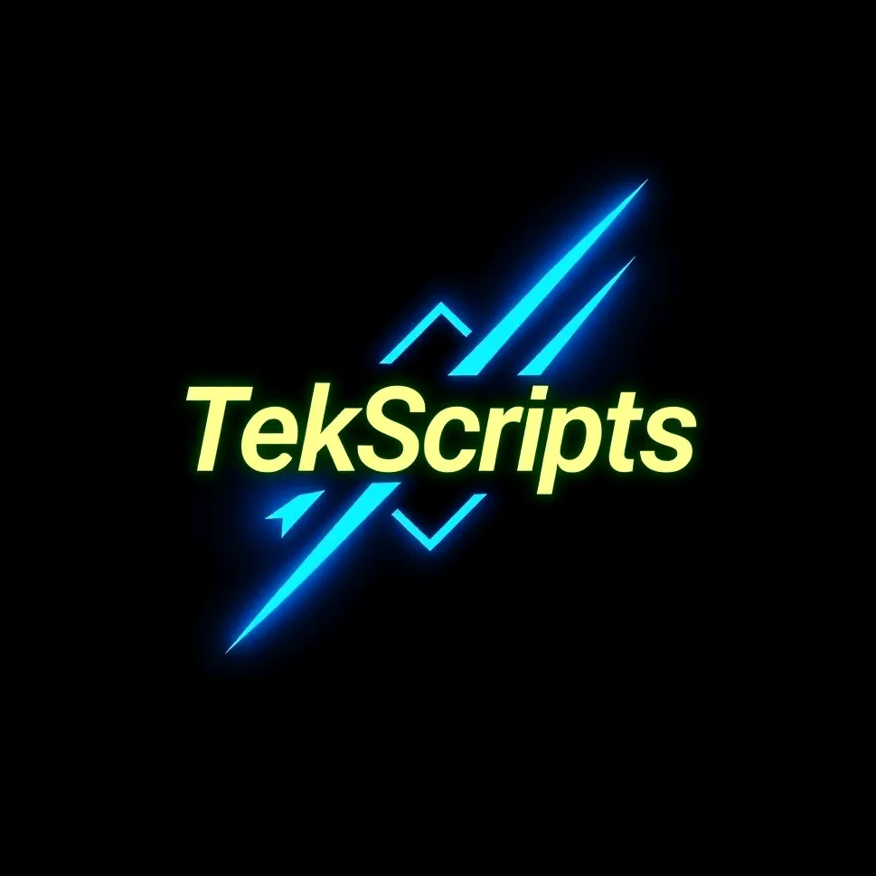

# Tekscripts UIX: Documentação Oficial

<p align="center">
  
</p>

## Inicializacao:init
Impõe esse trecho no início do código para usar os componentes da Labary

```lua
-- > Inicialização da UI
local Tekscripts = loadstring(game:HttpGet("https://raw.githubusercontent.com/c0nfigs/LibUix/refs/heads/main/init.lua"))()
```

## Tekscripts:FloatButtonEdit
Edição abrangente do Float Button, botão de fechar e abrir a interface
```lua
Tekscripts:FloatButtonEdit({
    Text = "Abrir Menu", -- > String // Nome que vai aparecer no FloatButton, editável pelo new também.
    Icon = "menu" -- > String // ícone que vai aparecer no lado esquerdo
})
```

## Tekscripts:new
criação do Window principal, essencial para a criação dos componentes
```lua
local gui = Tekscripts.new({
    Name = "MeuPainel", -- > String // Nome que vai aparecer no título do painel
    FloatText = "Abrir Painel", -- > String // Texto que vai aparecer no floatButton de abrir e fechar a interface
    startTab = "auto", -- > String // Variável da tab que vc quer que já venha selecionada
    iconId = "rbxassetid://105089076803454", -- > String // id que vc quer usar de icone
    Transparent = true, -- > Classifica se vc deseja que o painel seja transparente
    WindowTransparency = 0.5, -- > Number // transparência do box da interface
    LoadScreen = true, -- > bolean // Sistema de carregamento
    Loading = { 
    Title = "TekScripts", 
    Desc = "By: Kauam"
    }, -- > Array // config da tela de carregamento
})
```

## Tekscripts:CreateTab
Uso Básico
```lua
-- > Cria uma nova aba na interface
local MinhaAba = Tekscripts:CreateTab({
    Title = "Minha Aba" -- > String
})
```
### Métodos disponíveis
1. Destruir Aba
```lua
-- > Remove a aba da interface, limpa conexões e deleta o botão lateral.
MinhaAba:Destroy()
```

2. Alternar Aba (Via Script)
```lua
-- > Caso queira forçar a visualização de uma aba específica programaticamente.
Tekscripts:SetActiveTab(MinhaAba)
```

---

## Tekscripts:CreateToggle


### 📋 Estrutura do Parâmetro `options`

| Parâmetro | Tipo | Descrição |
| :--- | :--- | :--- |
| `Text` | `string` | Nome principal exibido no Toggle. |
| `Desc` | `string?` | Descrição detalhada abaixo do título (opcional). |
| `Callback` | `function` | Função executada ao alternar o estado (`state: boolean`). |
| `Type` | `string?` | Define o estilo visual: `"Toggle"` (Padrão) ou `"CheckBox"`. |
| `FeedbackDebug`| `boolean?`| Se `true`, exibe tremor e borda vermelha em erros (Padrão: `true`). |

---

### 🚀 Exemplo de Uso
```lua
-- > Exemplo básico de um Toggle de velocidade
local meuToggle = Tekscripts:CreateToggle(minhaAba, {
    Text = "MeuToggle Title", -- > String
    Desc = "MeuToggle Description", -- > String
    Type = "Toggle", -- > Toggle ou CheckBox
    FeedbackDebug = true, -- > boolean
    Callback = function(state)
        if state then
            print("Velocidade ativada!")
        else
            print("Velocidade desativada!")
        end
    end
})

-- > Definindo o estado manualmente via código
meuToggle:SetState(true) -- > boolean
````
🛠️ API do Componente (Métodos Públicos)
Após criar o toggle, você pode manipulá-lo usando os seguintes métodos:
| Método | Descrição | Uso Típico |
|---|---|---|
| :SetState(bool) | Altera o estado visual e interno sem disparar o Callback. | Sincronizar UI com dados salvos. |
| :GetState() | Retorna o estado atual (true ou false). | Checar valor antes de uma ação. |
| :SetLocked(bool) | Bloqueio Administrativo: Desativa a interação por tempo indeterminado. | Bloquear recursos VIP ou níveis baixos. |
| :SetBlocked(bool) | Bloqueio de Segurança: Impede cliques durante processos de erro ou cooldown. | Evitar spam de cliques em funções lentas. |
| :PulseError() | Dispara o efeito visual de erro (tremor e borda vermelha) e bloqueia o botão brevemente. | Notificar que uma ação falhou. |
| :Destroy() | Remove o componente da UI e limpa as conexões de memória. | Troca de mapas ou fechamento da GUI. |
> [!IMPORTANT]
>💡 Qual a diferença entre Locked e Blocked?
 * SetLocked(true): É como colocar um cadeado. O botão para de responder até que você chame SetLocked(false). Ideal para travar opções que o jogador ainda não desbloqueou.
 * SetBlocked(true): É como um sistema de segurança. Ele é usado internamente pelo PulseError() para evitar que o usuário clique repetidamente enquanto o script processa uma falha. Ele costuma ser temporário.
 * Observação: `SetState` altera o estado sem disparar o Callback.

⚠️ Exemplo de Tratamento de Erro na API
Se você precisar validar algo antes de permitir que o Toggle mude, use o PulseError:

```lua
-- > uso real do componente Toggle/Api Pulse
local TestePulse = Tekscripts:CreateToggle(MinhaAba, {
    Text = "Teste Pulse error",
    Callback = function(v)
        local char = game.Players.LocalPlayer.Character
        local hum = char and char:FindFirstChild("Humanoid")
        if not hum then return end
        
        -- > Verifica se o jogador está sentado
        if v and not hum.SeatPart then
            Tekscripts("Erro", {Text = "Error"})
            
            -- > Feedback visual e reseta o toggle
            TestePulse:PulseError() -- > Chamada do pulse error
            TestePulse:SetState(false) -- > passa o false para o toggle
            return
        end
        Tekscripts:Notify({
        Text = "Sucesso",
        Desc = "Função executada com sucesso"
       })
    end
})
```

## Tekscripts:CreateSlider
exemplo da criação do componente de Slider

```lua
-- > exemplo de criação componente slider
local MeuSlider = Tekscripts:CreateSlider(MinhaTab, {
    Text = "MeuSlider", -- > String // valor que vai aparecer no título.
    Min = 0, -- > Number // valor mínimo
    Max = 100, -- > Number // Valor máximo
    Step = 5, -- > Number // Valor adicionando/removido a cada arrasto
    Value = 25, -- > Number // valor inicial
    Callback = function(v)
        print("Valor:", v)
    end
})
```

| Método | Descrição |
| --- | --- |
| :Get() | Usa a variável que o Slider está associado, ele vai retornar o valor atual dele. |
| :Set(50) | Passa o valor que ele vai impor no Slider associado, após a criação dele. |
| :GetPercent() | Percentual 0-1 |
| :SetRange(10, 300, 10) | Altera o range dinamicamente. |
| :AnimateTo(80, 0.4) | Animar até um valor específico |
| :SetLocked(bool) | Permite alterar o bloqueio do Slider dinamicamente. |
| :Destroy() |  Permite destruir o Slider após a criação. |

### Exemplos
Escutar mudanças ( sem mexer no callback original )
```lua
-- > escutar as mudanças sem mexer no callback
MeuSlider:OnChanged(function(v)
    print("Mudou:", v)
end)
```
### Atualizar opções
alterar as opções dinamicamente
```lua
-- > atualizar opções dinamicamente
MeuSlider:Update({
    Text = "Nova Velocidade",
    Value = 60
})
```

### exemplo de uso real
copie e cole após a criação da 'MinhaTab'
```lua
-- > uso real do componente slider
local speedSlider = Tekscripts:CreateSlider(MinhaTab, {
    Text = "WalkSpeed",
    Min = 8,
    Max = 50,
    Step = 1,
    Value = 16,
    Callback = function(v)
        game.Players.LocalPlayer.Character.Humanoid.WalkSpeed = v
    end
})

speedSlider:OnChanged(function(v)
    print("Speed atual:", v)
end)
```

## Tekscripts:CreateTextBox
Criação do componente TextBox

```lua
-- > criação do componente
local logBox = Tekscripts:CreateTextBox(MinhaTab, {
    Text = "Log", -- > String // Texto que vai aparecer no título
    Desc = "Eventos do sistema", -- > String // descrição.
    Default = "Inicializando...\n", -- > String // Texto inicial no box
    ReadOnly = true -- > Boleano // define se o usuário vai poder interagir com o box e editar os textos.
})
```

| Método | descrição |
| --- | --- |
| :SetText("Novo texto") | Permite subestir o texto inteiro do box |
| local txt = logBox:GetText() | Pega o texto atual |
| :Append("Evento conectado") | Adiciona uma minha no log, real |
| :Clear() | Limpar tudo |